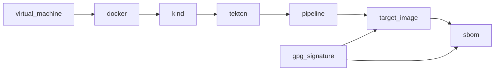

# Embedded Software Factory

## License

SPDX-License-Identifier: [GPL-2.0-or-later](COPYING)

## Reference

- [Supply chain Levels for Software Artifacts (SLSA)](https://slsa.dev)
- [`tekton_in_kind.sh`](https://github.com/tektoncd/plumbing/tree/main/hack#tekton_in_kindsh)
